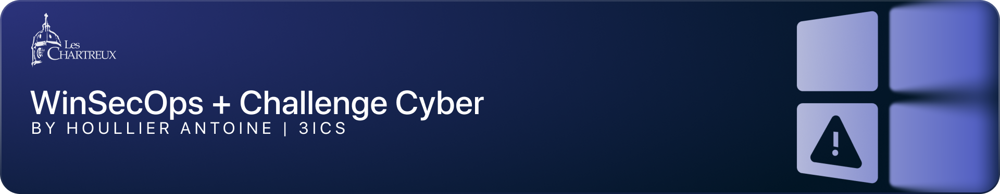

# 🛡️ SecOps Ateliers & Challenge Cybersécurité

Bienvenue dans ce projet dédié à la cybersécurité sur des environnements Windows. Retrouvez ci-dessous les liens vers les différents ateliers et le challenge.

---

## 📜 Sommaire

- [Atelier 1 : Action de reconnaissance](atelier1.md)
- [Atelier 2 : Compromission de credentials](atelier2.md)
- [Challenge Cybersécurité Windows](challengecyber.md)

---

## 🎯 Objectif

Renforcer vos compétences en cybersécurité grâce à des exercices pratiques et un challenge immersif.

---
