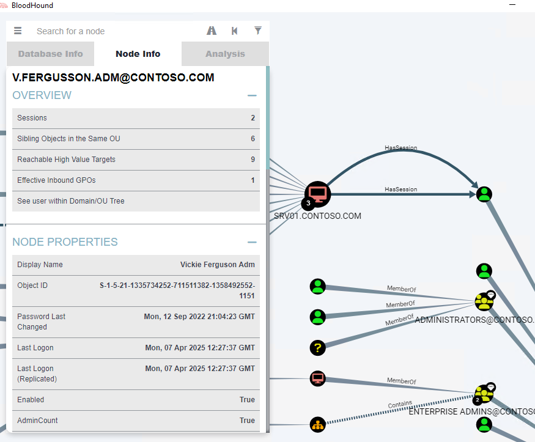

# Atelier 1 :  Action de reconaissance

## Exercice 1 - Préparer l’environnement
Vous trouverez probablement l’environnement familier car il s’agit de la continuité des laboratoires précédents. Nous avons les machines suivantes:

DC01 un contrôleur de domaine pour contoso.com exécutant Windows Server 2016 dans le site HQ Active Directory
DC02 un contrôleur de domaine pour contoso.com exécutant Windows Server 2022 dans le site Beijin Active Directory
SRV01 un serveur joint à un domaine membre du domaine contoso.com exécutant Windows Server 2022
CLI01 un client joint à un domaine membre du domaine contoso.com exécutant Windows 11
Tâche 1 - Créer des activités sur SRV01
Connectez-vous à SRV01. Utilisez les informations d’identification suivantes :

Nom d’utilisateur	CONTOSO\lee.mendoza.adm
Mot de passe	NeverTrustAny1!
Faites un clic droit sur le menu Démarrer image et cliquez sur Exécuter.

Dans la fenêtre Exécuter, tapez \\DC01\SYSVOL et cliquez sur OK.

### 📝 Quels types de fichiers pouvons-nous trouver dans ce dossier?
> dans le dossier Sysvol, on y trouve un dossier nommé contoso.com, avec comme contenu un dossier Policies et un dossier Scripts. Le dossier Policies contient des fichiers de stratégies de groupe (GPO) qui sont appliquées aux objets Active Directory, tandis que le dossier Scripts contient des scripts qui peuvent être exécutés par les utilisateurs ou les ordinateurs lors de la connexion ou de la déconnexion.
> 

> 

## Exercice 2 - utiliser bloodhound

### Tâche 1 - Executer SharpHound

Changez le répertoire actuel en tapant cd \Tools\Scripts et appuyez sur Entrée.

> 
#### 📝 ls est un alias pour quelle commande PowerShell ?
> ls est un alias pour la commande Get-ChildItem, qui permet d'afficher la liste des fichiers et des dossiers dans le répertoire actuel. C'est pareil pour dir


Exécutez SharpHound en exécutant la commande :
```powershell
.\sharphound.exe --collectionmethods All --skippasswordcheck
```
> 

> 
```shell
 220 name to SID mappings.
 2 machine sid mappings.
 4 sid to domain mappings.
 0 global catalog mappings.
2025-04-07T05:38:42.4515739-07:00|INFORMATION|SharpHound Enumeration Completed at 5:38 AM on 4/7/2025! Happy Graphing!
```

Maintenant, nous voulons aussi énumérer autant de SRV01. Nous allons créer un fichier qui contiendra notre longue liste d’ordinateurs à analyser... Eh bien, juste un. Exécutez le 
```powershell
Write-Output "SRV01.contoso.com" | Out-File computers.lst
```

Exécutez SharpHound à nouveau, mais cette fois en exécutant :
```powershell
.\sharphound.exe --collectionmethods All --computerfile computers.lst --skippasswordcheck
```
Vous pouvez voir les fichiers de collection que vous avez créés en exécutant la commande suivante dir *.zip.

#### 📝 Combien de fichiers zip voyez-vous?
> 
Nous voyons 5 fichiers zip, et 2 qui sont du jour.


### Tache 2 : Executer BloodHound

> 
> 


#### 📝 Pouvez-vous voir qui a une session et d’où?
> 
> On peux voir que c'est Vickie Ferguson Adm sur le SRV1 qui a une session ouverte (nous en l'occurence)

Dans Search for a node dans le coin supérieur gauche, tapez SRV01.CONTOSO.COM. Vous devriez voir une icône de machine au centre de la fenêtre. Faites un clic droit dessus et sélectionnez Chemins les plus courts vers ici.
> 

> PDRCAN : Cela signifie que l'utilisateur est membre du groupe local Remote Desktop users sur le SRV01


## Exercice 3 - Activer la journalisation LDAP


#### 📝 Quelle est la valeur par défaut de toutes les configurations de diagnostic ? 
> De base, elle est a 0, ce qui signifie que la journalisation est désactivée.


### Tache 3 -  Afficher les journaux LDAP


## Exercice 4 - Restreindre l’énumération SAM-R sur un serveur membre

### Tâche 1 - Confirmer l’appartenance à un groupe local
Connectez-vous à SRV01. Utilisez les informations d’identification suivantes :

Nom d’utilisateur	CONTOSO\blue
Mot de passe	NeverTrustAny1!
Vous pouvez utiliser le bouton Changer d’utilisateur en bas si nécessaire.

Faites un clic droit sur le menu Démarrer image et cliquez sur Exécuter.

Dans la fenêtre Exécuter, tapez 'cmd' et cliquez sur OK.

Dans la fenêtre d’invite de commandes, tapez 'net localgroup « Utilisateurs du Bureau à distance"' et appuyez sur Entrée.

> 

#### 📝 Qui est membre du groupe?
> `Abigail.Storey`

### Tache 2 - Corriger la configuration SAM-R du SRV01

Dans la fenêtre Éditeur de stratégie de groupe locale, accédez à Local Computer Policy > Computer Configuration > Windows Settings > Security Settings > Local Policies > Security Options. Double-cliquez sur la Stratégie appelée Network Access : Restrict clients allowed to make remote calls to SAM. Cliquez sur Modifier la sécurité... et notez les principaux de sécurité actuels.

> 

#### 📝 Pourquoi l’utilisation d’une stratégie de groupe est-elle recommandée pour utiliser une stratégie de groupe pour ces paramètres ?
> Cela permet une uniformité des configuration de sécurité entre les membres de domaines, ici nos DC par exemple, et d'éviter de faire la même configuration sur chaque machine. De plus, cela permet de centraliser la gestion des stratégies de sécurité et de faciliter leur mise à jour ou leur modification en cas de besoin.

## Exercice 5 - Énumérer les utilisateurs du domaine et les regrouper de manière anonyme

### Tâche 1 - Utiliser l’énumération SAM-R anonyme
> 


### Tâche 2 - Bloquer l’énumération SAM-R anonyme


#### 📝 Qui d’autre est membre de ce groupe dans le laboratoire?
> Authenticated Users, ainsi que Exchange Domain Servers
Dans la console Services, cliquez avec le bouton droit sur le service Serveur et cliquez sur Redémarrer. Une fenêtre contextuelle vous demandera si vous souhaitez redémarrer les dépendances, cliquez sur Oui.

### Tâche 3 - Vérifier que l’énumération SAM-R anonyme est désactivée

#### 📝 Qu’est-ce que le message d’erreur ?
```log
Host script results:
| smb-enum-users:
|_  ERROR: Access denied while trying to enumerate users; except against Windows 2000, Guest or better is typically required
```
> L'acces est refusé, ce qui signifie que l'énumération SAM-R anonyme est désactivée.


## Exercice 6 - Restreindre l’énumération SMB [facultatif]

### Tâche 1 - Vérifier à nouveau l’énumération SMB
Dans le terminal, assurez-vous que vous êtes dans un onglet PowerShell et dans le répertoire C:\Tools\Scripts. Exécutez le script suivant .\Invoke-NetSessionEnum.ps1 -Hostname DC01
> 


### Tâche 2 - Restreindre l’énumération SMB avec NetCease
> 


#### 📝 Essayez d’exécuter la commande précédente sans le « | Out-GridView -Title "SMB permissions". What is the difference?

> 
> On a accès a la vue CLI.


### Tâche 3 - Vérifier une dernière fois l’énumération SMB

#### 📝 Voyez-vous toujours des connexions ?
> 
> Non, il n'y a plus de connexions SMB actives sur le DC01.
