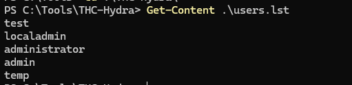
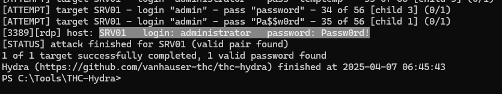
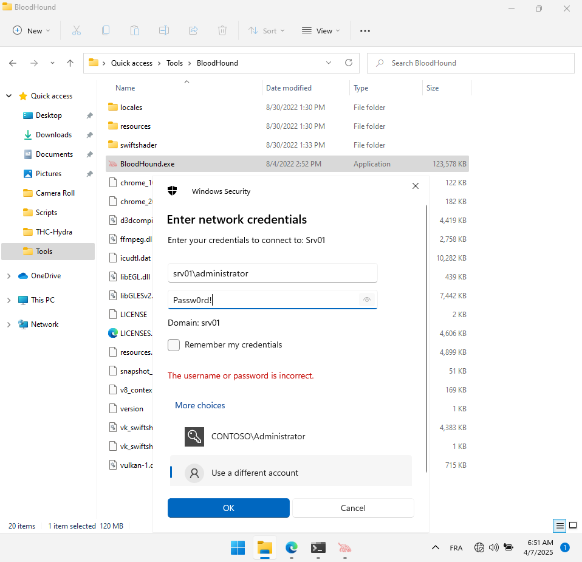
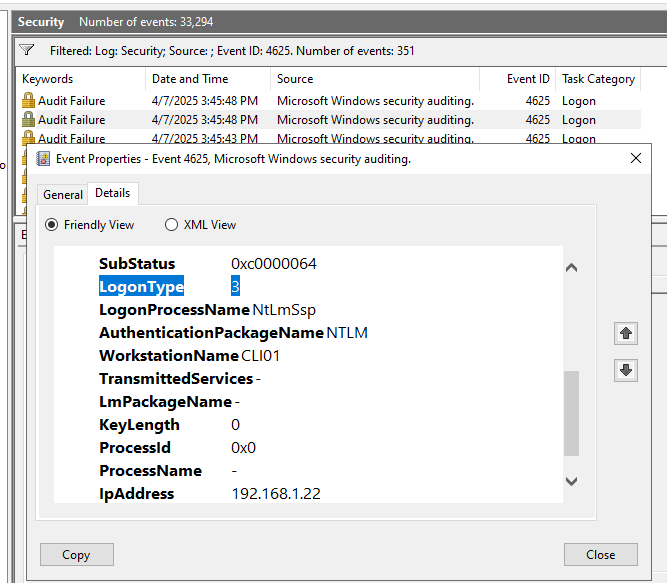
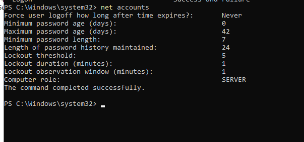
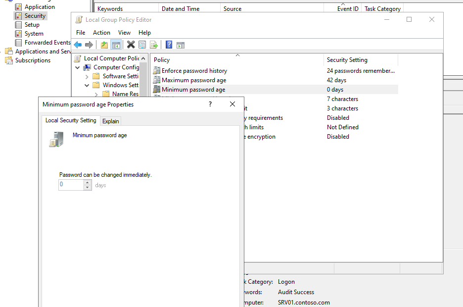
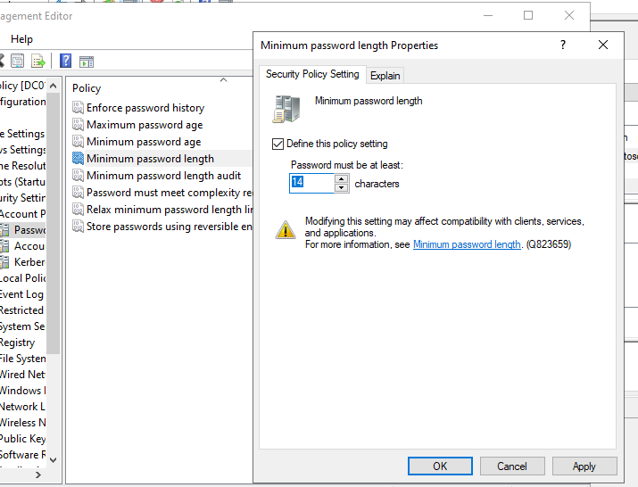
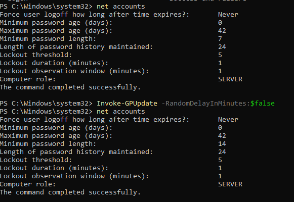
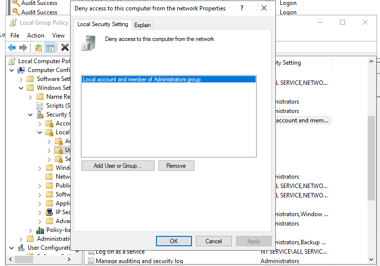

# Atelier 2 : Compromission de credentials

## Exercice 1 - Compromettre un compte d’administrateur local
### Tâche 1 - Pulvériser le mot de passe du compte administrateur de SRV01

> 

.\hydra.exe -V -F -L .\users.lst -P .\passwords.lst SRV01 rdp
> 

Testons-le maintenant et ouvrons une fenêtre Explorateur de fichiers. Dans la barre d’adresse, tapez \\SRV01\C$ et appuyez sur Entrée. Une fenêtre contextuelle d’authentification devrait s’afficher. Utilisez les informations d’identification fraîchement devinées :

> 

### Tâche 2 - Vérification des traces laissées sur SRV0

> Filtre 4625 (echec) :
> 
> Ici type 3, donc une connexion réseau.

> Filtre 4624 (succes) :
> 

auditpol /get /subcategory:Logon
#### 📝 Quelle est la commande pour répertorier toutes les catégories d’audit ?
> auditpol /get /category:*

## Exercice 2 - Sécurisation du compte d’administrateur local
### Tâche 1 - Stratégie de mot de passe pour les serveurs membres

Dans la fenêtre Local Computer Policy Editor, accédez à Local Computer Policy > Computer Configuration > Windows Settings > Security Settings > Account Policies > Password Policies.

#### Pouvez-vous modifier l’un des paramètres ?

> On ne peux pas modifier la majorité des paramètres, sauf "Relax Minimum password lenght limits" et "Relax minimum password length limits".

### Tâche 2 - Restreindre l’utilisation du compte d’administrateur local

### Tâche 3 - Vérifier la restriction de connexion de l’administrateur local