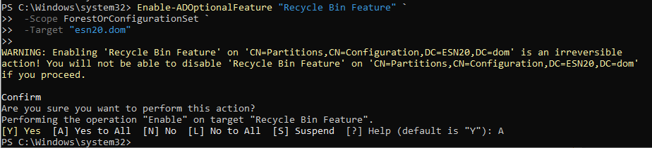

# Challenge cybersécurité windows

### Démonstration vidéo de l'attaque Kerberoast
[](https://youtu.be/nf0wV-eWYpw)
https://youtu.be/nf0wV-eWYpw?si=qhRCg0UajgfGL7oG
## Avant :

**[Rapport pinkcastle avant correction](rapport_pinkcastle/Apres/ad_hc_esn20.dom.html)**  

Privileged account : 70/100


Anomalies analysis :  70/100


Stale objects : 61/100


Indicators global : 70/100


## Corrections :

### 1. Marquer les comptes d’admin comme sensibles
- 2 comptes d’admin n’ont pas le flag "Ce compte est sensible et ne peut pas être délégué"

- **Solution :**
```powershell
Get-ADUser -Filter {AdminCount -eq 1} -Properties AccountNotDelegated | 
Where-Object { $_.AccountNotDelegated -ne $true } |
ForEach-Object {
    Write-Host "Fixing delegation for: $($_.SamAccountName)"
    Set-ADAccountControl $_ -AccountNotDelegated $true
}
```


### 2. Éviter l’utilisation du compte Administrateur natif
-  Le compte Administrator a été utilisé récemment

- **Solution :**
Créer un nouveau compte admin
```powershell
New-ADUser -Name "Admin.ESN20" -SamAccountName Admin.ESN20 -AccountPassword (Read-Host -AsSecureString "Password") -Enabled $true
Add-ADGroupMember -Identity "Domain Admins" -Members "Admin.ESN20"
```
Désactiver le compte Administrator
```powershell
Disable-ADAccount -Identity "Administrator"
```

### 3. Empêcher les mots de passe vides
- Un compte peut avoir un mot de passe vide
- **Solution :**
```powershell
Search-ADAccount -PasswordNeverExpires:$true -UsersOnly | 
Where-Object {($_.PasswordNotRequired -eq $true)} | 
Set-ADUser -PasswordNotRequired $false
```
On peux également renforcer la GPO :


### 4. Bloquer NTLMv1 / LAN Manager
    - Network security: LAN Manager authentication level = "Send NTLMv2 response only. Refuse LM & NTLM" 
 

### 5. Installer LAPS
- ✅ Enable password backup for LAPS = Enabled

- ✅ Configure password backup directory = Active Directory

- ✅ Do not allow password expiration time longer than required by policy = Enabled

- ✅ Password Settings > Password length = 16

- ✅ Password complexity = Enabled


### 6. Faire une sauvegarde Active Directory
- **Solution :**
```powershell
wbadmin start systemstatebackup -backuptarget:D:\
```


### 7. Vérifier les comptes de service
- **Solution :**
```powershell
Get-ADGroupMember -Identity "Domain Admins" | Select-Object Name

Remove-ADGroupMember -Identity "Domain Admins" -Members "svc-backup" -Confirm:$false
```
Créer un groupe dédié avec privilèges minimaux
```powershell	
New-ADGroup -Name "ESN20-Backup-Services" -GroupScope Global -GroupCategory Security

Add-ADGroupMember -Identity "ESN20-Backup-Services" -Members "svc-backup"
```
Retrait du SPN
```powershell
Set-ADUser -Identity "svc-backup" -ServicePrincipalNames @{}
```


### 8. Activer la corbeille Active Directory
- **Solution :**
```powershell
Enable-ADOptionalFeature "Recycle Bin Feature" `
 -Scope ForestOrConfigurationSet `
 -Target "esn20.dom"
```



### 9. Retirer admin du Schema Admins
- **Solution :**
```powershell
Get-ADGroupMember "Schema Admins" | ForEach-Object {
    Remove-ADGroupMember -Identity "Schema Admins" -Members $_ -Confirm:$false
}
```


### 10. Stopper service print spoooler :
- **Solution :** On l'enleve, puisqu'on n'host jamais le service d'impression sur un serveur de domaine !
```powershell
Stop-Service -Name Spooler -Force
Set-Service -Name Spooler -StartupType Disabled
```


### 11. Mettre en place une politique d'audit complete sur les dc
- **Solution :** Créer une GPO :


## Vérification des résultats
Il n'est plus possible de refaire l'attaque kerberoast, le mot de passe est trop long et complexe, il change régulierement, et le compte de service n'est plus dans le SPN.


### Resultats pinkcastle (voir directory /rapport_pinkcastle/avant et /apres)


Certains critères sont peu représentatif, notamment pour l'histoire de l'admin qui s'est connecté il y a 6 jours (et donc reste dans pinkcastle...), ainsi que LAPS qui, je ne sais pas pourquoi, n'est pas pris en compte dans le rapport. J'ai du mal faire une install.  C'était interessant ! :D